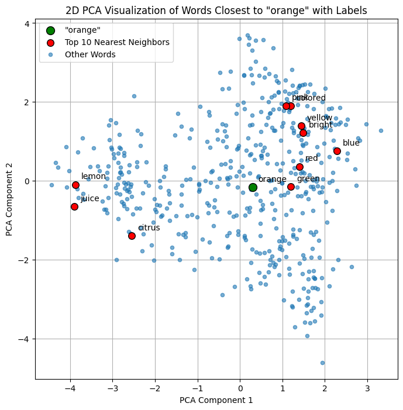

# Báo cáo thực hành Lab 4 - Words embedding
_Hoàng Văn Phú_ 
<br>
_23001546_
<br>
Xem code đầy đủ trên trang [Github](https://github.com/phuhoangg/NLP)
<br>
**Các phần xử lí lỗi trong codebase được xử lí bởi `Claude Code`, các logic còn lại do sinh viên tự thực hiện, lỗi syntax được kiểm tra bởi `ChatGPT`.**
<br>

## Phần 1: Tải và sử dụng `Gensim`:

- Đây là phần đơn giản, được hỗ trợ xử lí các lỗi bằng LLM
- `Gensim` có nhiều model đã được train sẵn trên với nhiều chiều như 50, 100, 200, 300
- Việc lấy `vector` của một từ đã được cài sẵn trong các __built-in function__ của model lấy từ `Gensim`
- __Cosine similarity__ được tính bằng tích vô hướng chia cho tích độ dài, ở đây, để tránh trường hợp chia cho số 0, các lấy cosine đã được thay đổi một chút bằng cách chuẩn hóa lại các vector của 2 từ cần tính cosine.
- Việc tìm bộ các từ đồng nghĩa cũng được cài đặt trong __built-in function__ của model

## Phần 2: Nhúng câu/văn bản:

- Sử dụng `RegexTokenizer` được xây dựng ở lab 1 để thực hiện tokenizer, nhược điểm của bộ tokenizer tự xây dựng này là nó quá đơn giản, như trong ví dụ thì dấu "."  vẫn được coi là một token. Bên cạnh đó có một nhược điểm trong cách nhúng câu văn bản ở bài làm này là các từ không có trong vocabulary thì sẽ trả về `None`. Đối với một documents chỉ chứa `Unknown Word` thì sẽ trả về `None`
- Hướng cải thiện có thể thêm vào là việc xử lí các `Unknow Word` hợp lí hơn để biểu diễn được nhiều từ nhất có thể

## Phần 3: Huấn luyện mô hình trên tập dữ liệu nhỏ
- Đây là phần đơn giản, không có khó khăn gì, có sử dụng sự hỗ trợ của LLM trong việc xử lí lỗi.

## Phần 4: Huấn luyện model trên tập dữ liệu lớn (dùng PySpark):
- Ở phần này, khó khăn chỉ xuất hiện ở việc cài đặt và chạy được `PySpark` trên local.

## Phần 5: Trực quan hóa Embedding:
- Ở bài này, bộ dữ liệu được chọn là bộ `glove` với 300 chiều dữ liệu, được chạy qua `PCA` để giảm chiều xuống 2 chiều và trực quan hóa
- Tuy nhiên khi trực quan hóa với dữ liệu 2 chiều, do số lượng chiều giảm quá lớn nên không thể hiện rõ được tính "gần" hoặc "xa" nhau của các vector, có thể thấy rõ trong ảnh dưới đây:<br>

- Có thể thấy rằng, top 10 từ gần nghĩa với `orange` rất hợp lí nhưng vì ta giảm chiều quá lớn dẫn đến chưa thể hiện rõ tính tương đồng của các vector.


### Đánh giá kết quả:

- Với việc sử dụng `PySpark` kết quả của mỗi lần huấn luyện sẽ có sự chênh lệch nhỏ:

```
Sample word vectors:
+-------------+--------------------+
|         word|              vector|
+-------------+--------------------+
|    professed|[0.08633494377136...|
|    pathogens|[0.03725191578269...|
|     purifies|[-0.0714086517691...|
|meteorologist|[0.02331640385091...|
|        denon|[-0.0080658206716...|
|  ferociously|[0.00619536358863...|
|       boxers|[0.00491470610722...|
|   thunderous|[0.01712719909846...|
|     embedded|[0.08003550022840...|
|   respecting|[0.08370206505060...|
+-------------+--------------------+
only showing top 10 rows

Top 10 synonyms for 'computer':
+-----------+------------------+
|       word|        similarity|
+-----------+------------------+
|    desktop|0.6432762145996094|
|  computers|0.6250925064086914|
|   software|0.6156256198883057|
|     laptop| 0.596653401851654|
|        mac|0.5953108072280884|
|        erp|0.5926023721694946|
|     device| 0.589663565158844|
|   desktops|0.5813782811164856|
|programming|0.5807300209999084|
|     tablet|0.5767044425010681|
+-----------+------------------+
```
<br>

```
Sample word vectors:
+-------------+--------------------+
|         word|              vector|
+-------------+--------------------+
|    professed|[0.01174354832619...|
|    pathogens|[0.05305056646466...|
|     purifies|[-0.0158986728638...|
|meteorologist|[0.06168860197067...|
|        denon|[-0.0745615214109...|
|  ferociously|[0.01675882562994...|
|       boxers|[-0.0142219951376...|
|   thunderous|[-0.0028754684608...|
|     embedded|[-0.2482849806547...|
|   respecting|[0.01428634952753...|
+-------------+--------------------+
only showing top 10 rows
                                                                                
Top 10 synonyms for 'computer':
+-----------+------------------+
|       word|        similarity|
+-----------+------------------+
|    desktop|0.6657819151878357|
|  computers|0.6575842499732971|
|       198x|0.6397810578346252|
|     coding|0.6046655774116516|
|programming|0.6046084761619568|
|   software|0.6015132665634155|
|     device|0.5996865630149841|
|     laptop|0.5942080020904541|
|   workflow|0.5869054198265076|
| interfaces|0.5867090225219727|
+-----------+------------------+
```
<br>

- Trên đây là kết quả của 2 lần huấn luyện, có thể thấy mỗi lần huấn huyện sẽ cho ra, lí do cho sự khác nhau này là khi khởi tạo, các vector ban đầu sẽ được gán một giá trị ngẫu nhiên, làm thay đổi đi hướng ban đầu của embedding.
- Tuy nhiên dù các vector có khác nhau nhưng tính tương đồng của các từ gần nghĩa không có sự chênh lệch đáng kể, điều đó cho thấy một hiệu suất tương đối tốt của mô hình trong việc biểu diễn các từ gần nghĩa nhau


##### Đối với `Word Embedder`:
- Kết quả cho ra là tương đối hợp lí, điểm cần cải thiện chỉ nằm ở việc sử dụng một `Tokenizer` cao cấp hơn thay vì sử dụng một phép biến đổi đơn giản được xây dựng ở lab_1, bên cạnh đó thêm phần xử lí cho các từ không xuất hiện trong vocabulary:
```
[1] Vector for 'king':
Dimension: 50

[2] Word Similarities:
Similarity(king, queen) = 0.7839
Similarity(king, man)   = 0.5309

[3] Top 10 most similar words to 'computer':
computers        0.9165
software         0.8815
technology       0.8526
electronic       0.8126
internet         0.8060
computing        0.8026
devices          0.8016
digital          0.7992
applications     0.7913
pc               0.7883

[4] Document Embedding:
['the', 'queen', 'rules', 'the', 'country', '.']
Sentence: "The queen rules the country."
Dimension: [ 0.04564168  0.36530998 -0.55974334  0.04014383  0.09655549  0.15623933
 -0.33622834 -0.12495166 -0.01031508 -0.5006717   0.18690467  0.17482166
 -0.268985   -0.03096624  0.36686516  0.29983264  0.01397333 -0.06872118
 -0.3260683  -0.210115    0.16835399 -0.03151734 -0.06204716  0.04301083
 -0.06958768 -1.7792168  -0.54365396 -0.06104483 -0.17618     0.009181
  3.3916333   0.08742473 -0.4675417  -0.213435    0.02391887 -0.04470453
  0.20636833 -0.12902866 -0.28527132 -0.2431805  -0.3114423  -0.03833717
  0.11977985 -0.01418401 -0.37086335  0.22069354 -0.28848937 -0.36188802
 -0.00549529 -0.46997246]
```
<br>

##### Đối với model tự train từ `gesim`, kết quả cho ra không được đánh giá cao:

```
Demo Word2Vec Usage

Top 10 most similar words to 'apple':
batch           0.9176
arguments       0.8905
kicked          0.8887
lastnight       0.8882
correction      0.8819
parish          0.8808
drunk           0.8795
literature      0.8756
connecticut     0.8756
margaret        0.8738

Analogy: paris - france + japan ≈ ?
plaster         0.6973
ireland         0.6659
target          0.6583
ucas            0.6509
bound           0.6459
```
- Mô hình được train với cấu hình như sau:
```Python
model = Word2Vec(
            sentences=sentences,
            vector_size=100,
            window=5,
            min_count=2,
            workers=4,
            sg=1,  # dùng skip-gram
            epochs=20
        )
```
- Có thể thấy ở kết quả sự không hợp lí với thực thế, phần analogy với mong muốn kết quả có xuất hiện `tokyo` nhưng không xuất hiện, lí do có thể nằm ở dataset không xuất hiện nhiều các từ này khiến mô hình không học được.
- Vấn đề cốt lõi ở đây có thể nằm ở `dataset` chứ không phải do cấu hình hay siêu tham số huấn luyện mô hình. Vấn đề ở phần này cho đến lúc hoàn thiện bài, em chưa rõ lí do kết quả lại không tốt như vậy, nếu thầy đọc được mong thầy giải đáp.